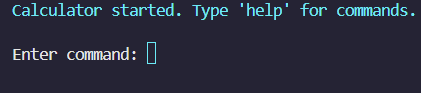
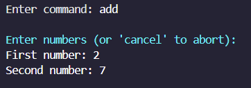
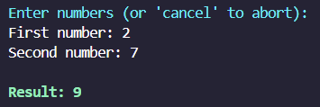
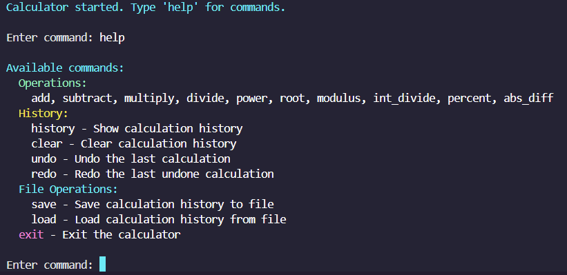
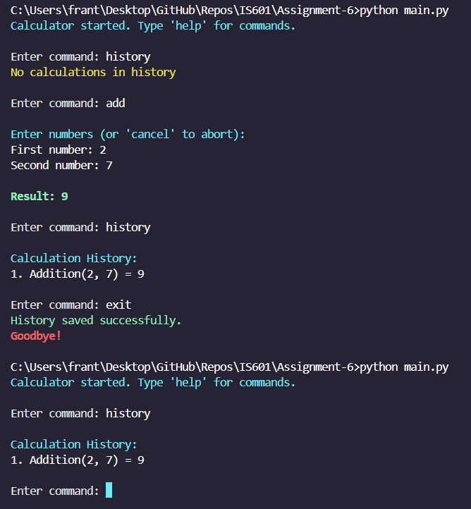

*Repo cloned from Assignment 3 and modified*  
*Repo cloned from Assignment 4 and modified*  
*Repo cloned from Assignment 5 and modified*

This project is a simple command-line calculator built using Python. which supports arithmetic operations via a REPL (Read-Eval-Print Loop) interface. This project also includes unit tests and CI/CD integration using GitHub Actions.

# Features

- REPL Interface for continuous user interaction.
- Arithmetic operations:
    - Addition,
    - Subtraction,
    - Multiplication,
    - Division,
    - Power,
    - Root,
    - Modulus,
    - Integer Division,
    - Percent,
    - Absolute Difference.
- Input validation and error handling for invalid inputs.
- Unit tests for the REPL and operation logic.
- Auto-saving calculation history and optional clearing.
- Load from and save to file in *.csv* format.

# Installation

Assuming that git is already setup and integrated into the command-line for the following git commands

## Follow these steps to set up the project locally.

1.  **Clone the repository:**

    ```
    git clone https://github.com/HaadiMalik/IS601-Assignment6-Midterm.git
    cd IS601-Assignment6-Midterm
    ```

2.  **Create a virtual environment:**

    To isolate dependencies, it's recommended to use a virtual environment.

    ```
    python3 -m venv venv
    ```

3.  **Activate the virtual environment:**

    On macOS/Linux:

    ```
    source venv/bin/activate
    ```

    On Windows:

    ```
    venv\Scripts\activate
    ```

4.  **Install dependencies:**

    ```
    pip install -r requirements.txt
    ```

# Usage

Once the environment is set up, you can start the calculator REPL by running:

```
python main.py
```


## Using the Calculator REPL

You will see the following upon starting:




The REPL will then wait for another command. Assuming the next prompt is a valid operation, you will be asked to enter two numbers, one after another:




And then after entering both and pressing enter/return, the result will show up in the following format:




## Help

To see the extent of calculator commands, enter 'help' when prompted:




## Exit

When finished using the REPL, type 'exit' when prompted:


## History

When exiting, history is automatically saved (shown in 'exit') in a .csv' file.  
When the calculator is restarted, it will look for that csv file and if successful, it will load the saved operation(s).  
To see the operations performed, type 'history' when prompted:




## Running Tests

The project includes comprehensive unit tests for both the REPL and the arithmetic operations. To run the tests:

1. **Ensure dependencies are installed (if not already done):**

```
pip install -r requirements.txt
```

2. **Run tests using pytest:**

```
pytest
```
